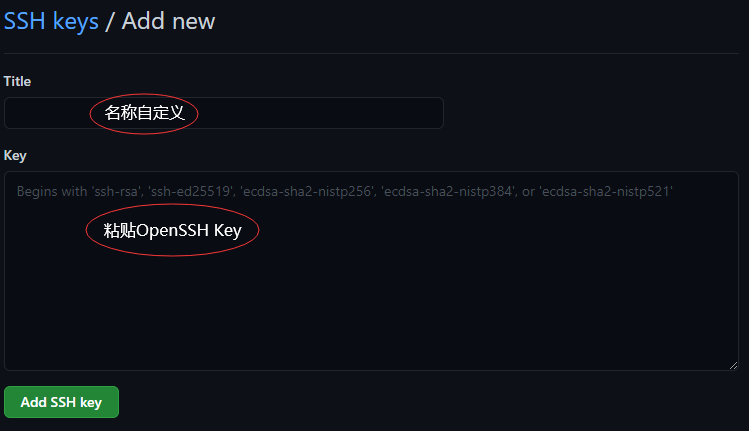

# github添加SSH Key

###### ### 个人学习整理，仅供参考

> 登录github账号，进入Settings

> 选择 "SSH and GPG keys" >> "New SSH key"

 

**Tip:  粘贴的Key是用指令复制的，直接复制文件是无效的**

**[获取git的OpenSSH Key](.\获得git的OpenSSH Key.md)**

